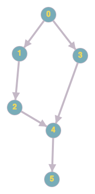

# git-fast-reword

## Зависимости
* libgit2  

#### macOS
```zsh
brew install libgit2
```

## Сборка и установка 
```zsh
$ go install
```

## Запуск и тестирование
```zsh
➜  git-fast-reword git:(master) ✗ make test
go build
cd utilite/testdata/django-like-queryset ; git reset --hard
HEAD сейчас на be51798 Update README.md
go test ./...
?       git-fast-reword [no test files]
ok      git-fast-reword/utilite 0.454s

➜  git-fast-reword git:(master) ✗ cd intellij-community 
➜  intellij-community git:(master) git-fast-reword -h
NAME:
   git-fast-reword - git-fast-reword hash new_message

USAGE:
   git-fast-reword [global options] command [command options] [arguments...]

COMMANDS:
   from-file, ff  
   help, h        Shows a list of commands or help for one command

GLOBAL OPTIONS:
   --help, -h  show help (default: false)
 
➜  intellij-community git:(master) cat ../test.json 
{
  "HEAD~31": "renamed HEAD~31",
  "HEAD~53": "renamed HEAD~53",
  "HEAD~173": "renamed HEAD~173"
}

➜  intellij-community git:(master) time git-fast-reword from-file ../test.json
2020/05/10 01:36:24 New head: a7287eff6f0e3f4196623b7c94dd6f0dc414d423
git-fast-reword from-file ../test.json  0,04s user 0,10s system 19% cpu 0,734 total

➜  intellij-community git:(master) git cat-file -p HEAD~31
tree 9876e6a8a3d9eb076d5787b4e54478409662ad7d
parent 77a3848975d4cbf80f54e356570c2a20c9f44683
author Yuriy Artamonov <yuriy.artamonov@jetbrains.com> 1588258011 +0300
committer intellij-monorepo-bot <intellij-monorepo-bot-no-reply@jetbrains.com> 1588326021 +0000

renamed HEAD~31

➜  intellij-community git:(master) git cat-file -p HEAD~53
tree c6d98eaac03c46a1824b578876165f68ae155aa5
parent e24ba542c515b53320853e5ba4f724e790442186
author Vladislav.Soroka <Vladislav.Soroka@jetbrains.com> 1588258289 +0300
committer intellij-monorepo-bot <intellij-monorepo-bot-no-reply@jetbrains.com> 1588326021 +0000

renamed HEAD~53

➜  intellij-community git:(master) git cat-file -p HEAD~173
tree 7a035ec1c133f15d8850da4362324d93f38354d5
parent 222aad0c9aa95fb671000476c035f384a1de39a2
author Semyon Proshev <Semyon.Proshev@jetbrains.com> 1587481536 +0300
committer intellij-monorepo-bot <intellij-monorepo-bot-no-reply@jetbrains.com> 1588197868 +0000

renamed HEAD~173

# случай, описанный ниже
➜  intellij-community git:(master) time git-fast-reword 13b78e06c18e2da98674b688e56df0b53b9fed76 "s bogom"
2020/05/10 01:42:03 New head: 26a3c1e5d52e5f83d792adbfbaee7bb763f86da2
git-fast-reword 13b78e06c18e2da98674b688e56df0b53b9fed76 "s bogom"  6,21s user 0,93s system 76% cpu 9,319 total


```

## Алгоритм
Утилита поиском в глубину обходит коммиты и обновляет их по надобности.
Рекурсия прекращается как только посещены все коммиты с новыми сообщениями,
поэтому в большинстве случаев утилита обойдет лишь малую часть графа.
Поскольку возможно существование пути между любыми двумя коммитами, то также
возможна такая ситуация:  
  
Допустим мы хотим переименовать коммит `2`. 
Поиск будет идти в следующем порядке: `0->1->2` – тут мы увидели,
что посетили все коммиты с новыми сообщениями (в этой ветке) и прерываем рекурсию.
Далее поиск пойдет в вершину `3` и так как мы не знаем наперед есть ли путь из этой
вершины в вершину `2`, то нам придется обойти весь граф до самого дна.
Ориентироваться на время коммита (как commiter, так и author) не вариант, поскольку
оно могло быть изменено до этого командой `rebase`. Я так и не придумал как можно
гарантировано избежать спуска на дно.
Поскольку даже в худшем случае утилита работает в пределах 10-13 секунд на репозитории
`IntelliJ IDEA Community Edition`, то я не стал париться и оставил все как есть.